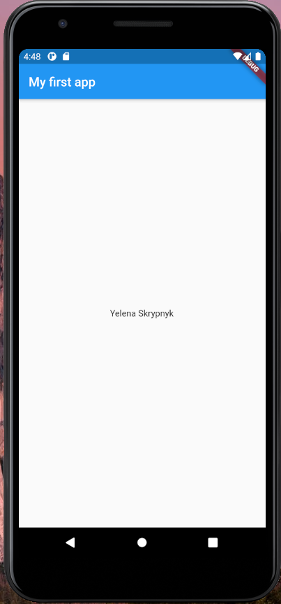

# 📱 Технології створення ПЗ для мобільних платформ
> Перша лабораторна робота курсу

## 📃 Завдання до першої лекції
- 1.Створити простий мобільний застосунок
  - 1.1 Застосунок повинен мати ім'я та прізвище
- 2.Використання ООП мови Dart. Конструктори, іменовані параметри, приватні поля, гетери, сетери.

## 📃 Завдання до другої лекції
- 1.Оператори "синтаксичного цукру". Наприклад оператор "??=".
- 2.Використання лямбда-функцій, замикань.
- 3.Використання параметрів за замовчуванням.
- 4.Різні варіанти конструкторів:
  - 4.1 Фабричний конструктор.
  - 4.2 Конструктор ініціалізації.
- 5.Використання міксинів.
- 6.Використання ключового слова assert.
- 7.Робота з колекціями.

## 📳 Результат виконання першого завдання

